# Automated Multi-Blog System Documentation

## System Architecture

The Automated Multi-Blog System is a serverless, AI-powered content generation and publishing platform designed for managing multiple blogs with minimal human intervention. The system leverages Azure Functions, OpenAI, and WordPress integration to provide a comprehensive solution for automated content creation and management.

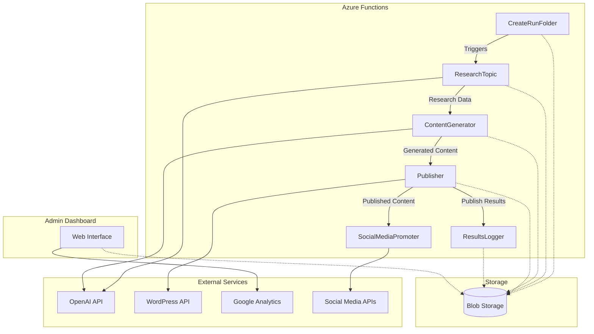

## Data Flow

The system follows a sequential flow where each component performs a specific task and passes the results to the next component:

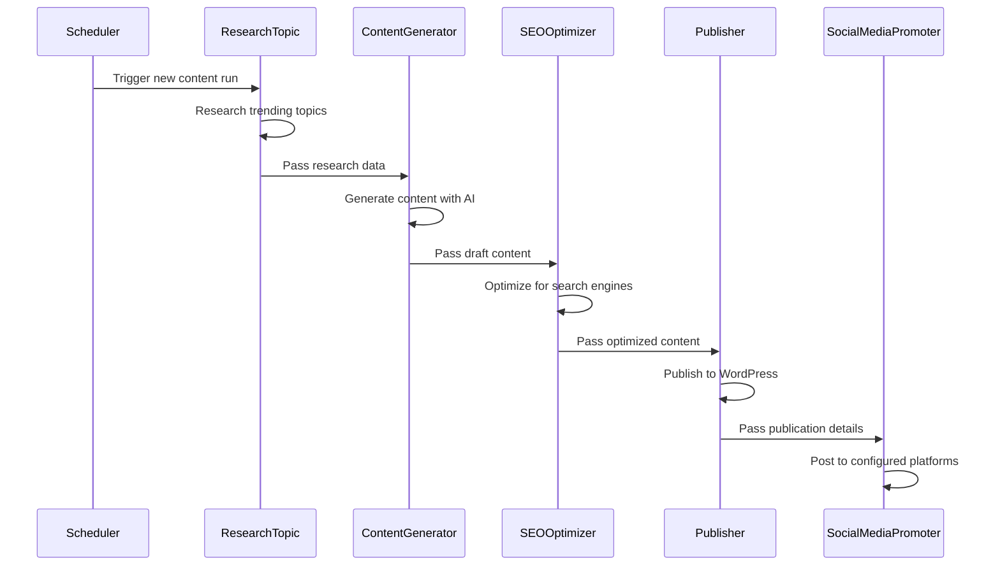

## Configuration System

The platform uses a configuration-driven approach where each blog has its own set of configuration files stored in a specific folder structure:

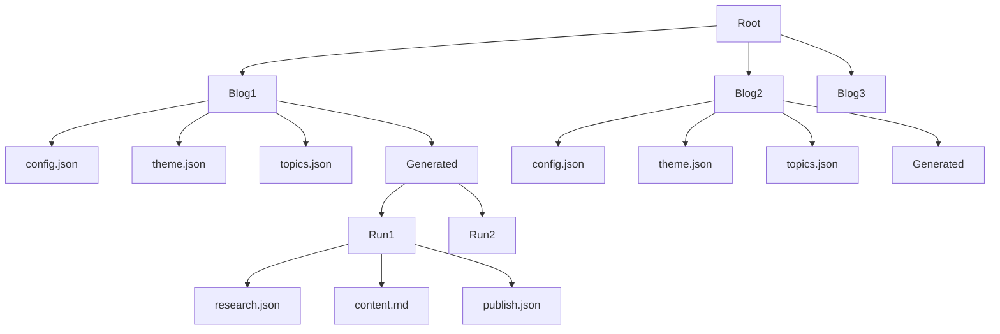

## Component State Machines

Each component in the system can be represented as a state machine that processes data and transitions between states:

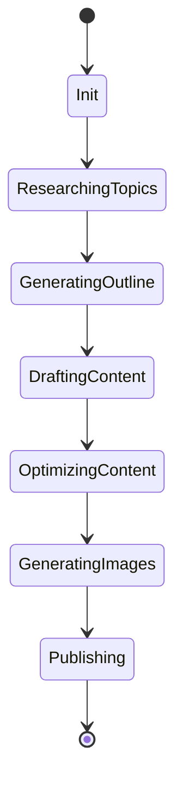

## Blog Creation Process

The process of creating a new blog involves several steps:

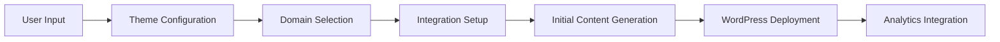

## Theme-Aware Content Generation

The system uses theme-specific prompts and guidance to ensure content aligns with each blog's unique voice and style:

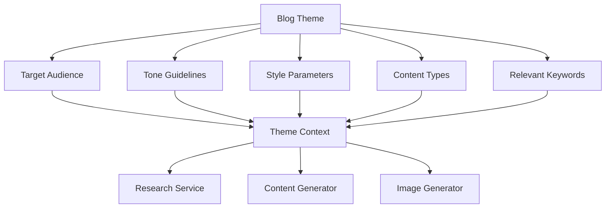

## Analytics and Monitoring

The system includes comprehensive analytics and monitoring capabilities:

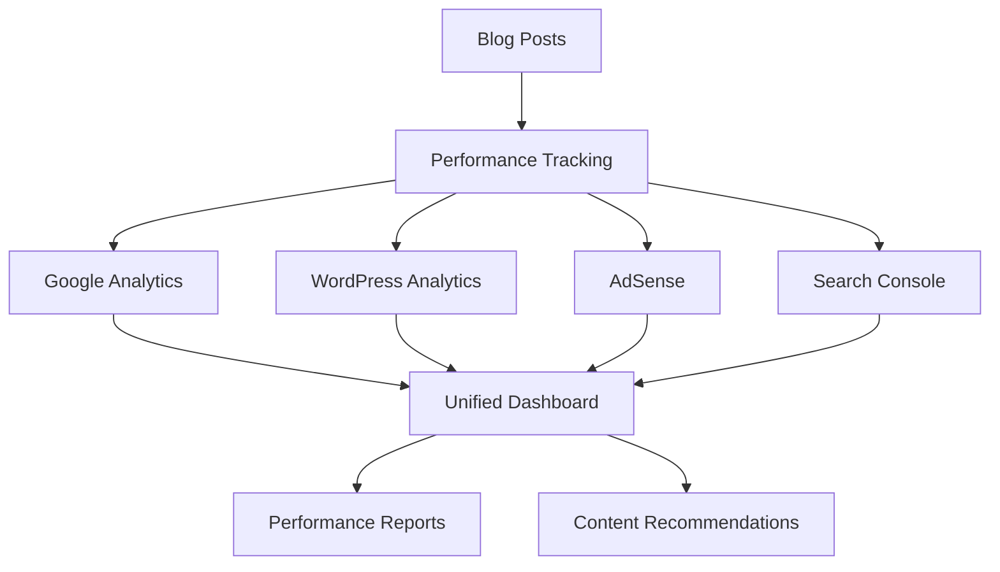

## AI Cost Optimization

The system includes features to optimize AI usage and control costs:

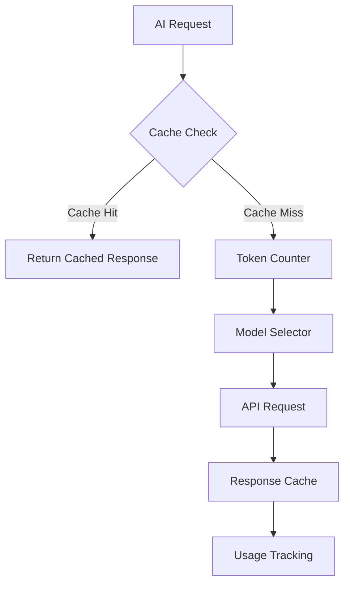

## Competitor Analysis System

The platform includes tools for analyzing competitor content and identifying opportunities:

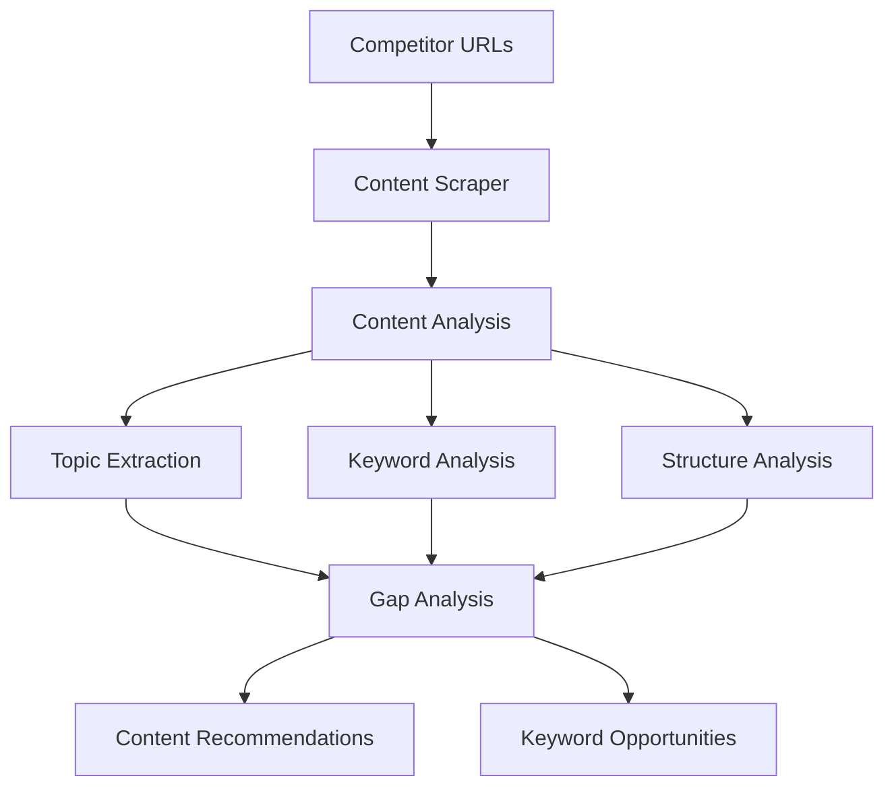

## Security and Authentication

The system uses Azure Key Vault for secure credential management:

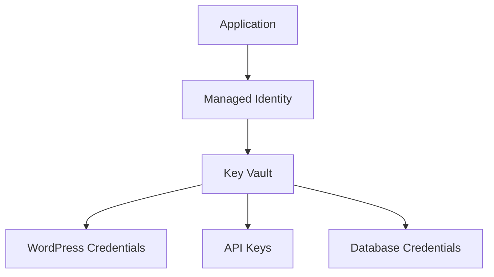

## Deployment Process

The system is deployed using Azure Bicep templates and GitHub Actions:

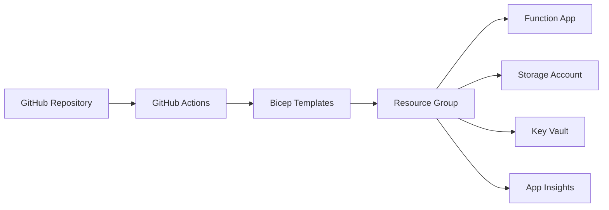

## Error Handling and Retry Mechanisms

The system includes comprehensive error handling and retry mechanisms:

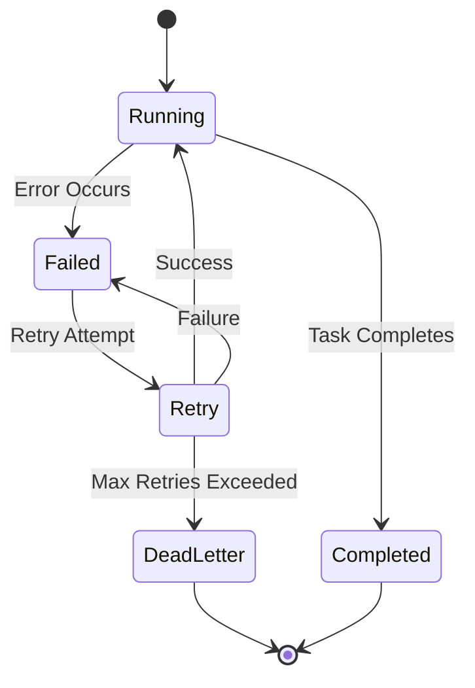