# Automated Multi-Blog Content Pipeline Documentation

## System Overview

The Automated Multi-Blog Content Pipeline is a serverless, AI-powered platform designed for autonomous content generation and publishing across multiple blogs. This system leverages Azure Functions, advanced AI models, and comprehensive blog management to create a fully automated content lifecycle.

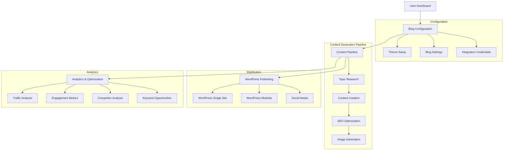

## Architecture Components

The system is built on a serverless architecture using Azure Functions, with each component handling a specific part of the content lifecycle.

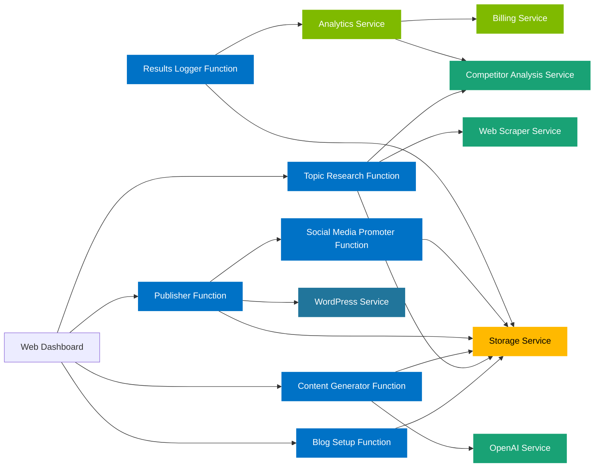

## System State Machine

The automated blog content pipeline follows a state machine pattern, where each piece of content progresses through various states from research to publishing and promotion.

```mermaid
stateDiagram-v2
    [*] --> BlogSetup
    
    BlogSetup --> TopicResearch: Blog Configured
    TopicResearch --> ContentGeneration: Topic Selected
    ContentGeneration --> SEOOptimization: Draft Created
    SEOOptimization --> ImageGeneration: SEO Applied
    ImageGeneration --> PublishReady: Images Generated
    
    PublishReady --> Publishing: Approved
    PublishReady --> ContentGeneration: Needs Revision
    
    Publishing --> Published: Success
    Publishing --> PublishError: Failure
    PublishError --> Publishing: Retry
    
    Published --> SocialPromotion: Scheduled
    SocialPromotion --> Promoted: Shared
    
    Promoted --> Analytics: Tracking
    Analytics --> [*]: Complete
    
    state BlogSetup {
        [*] --> ConfigureTheme
        ConfigureTheme --> ConfigureCredentials
        ConfigureCredentials --> IntegrationSetup
        IntegrationSetup --> [*]: Ready
    }
    
    state TopicResearch {
        [*] --> TrendAnalysis
        TrendAnalysis --> CompetitorResearch
        CompetitorResearch --> KeywordOpportunities
        KeywordOpportunities --> [*]: Topic Selected
    }
    
    state ContentGeneration {
        [*] --> OutlineCreation
        OutlineCreation --> DraftGeneration
        DraftGeneration --> ContentPolishing
        ContentPolishing --> [*]: Draft Ready
    }
    
    state SEOOptimization {
        [*] --> KeywordAnalysis
        KeywordAnalysis --> MetadataGeneration
        MetadataGeneration --> StructureOptimization
        StructureOptimization --> [*]: SEO Ready
    }
```

## Pipeline Components in Detail

### 1. Blog Setup Process

The blog setup process establishes the foundation for content generation by defining theme, audience, and integration points.

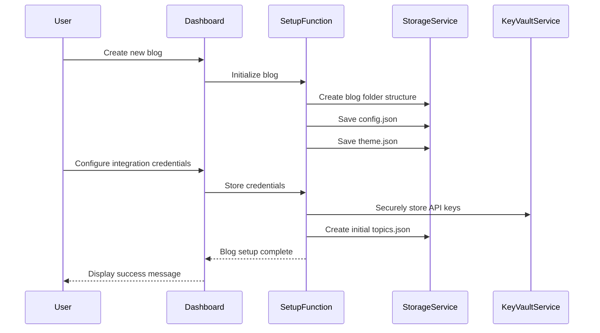

### 2. Research Pipeline

The research pipeline identifies trending topics and keyword opportunities from various sources and competitor analysis.

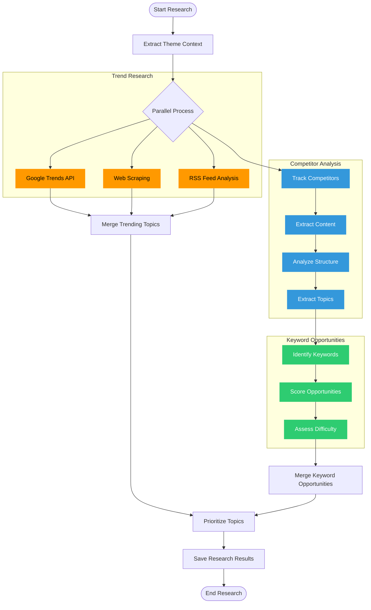

### 3. Content Generation

The content generation process uses AI to create optimized, polished content based on research inputs.

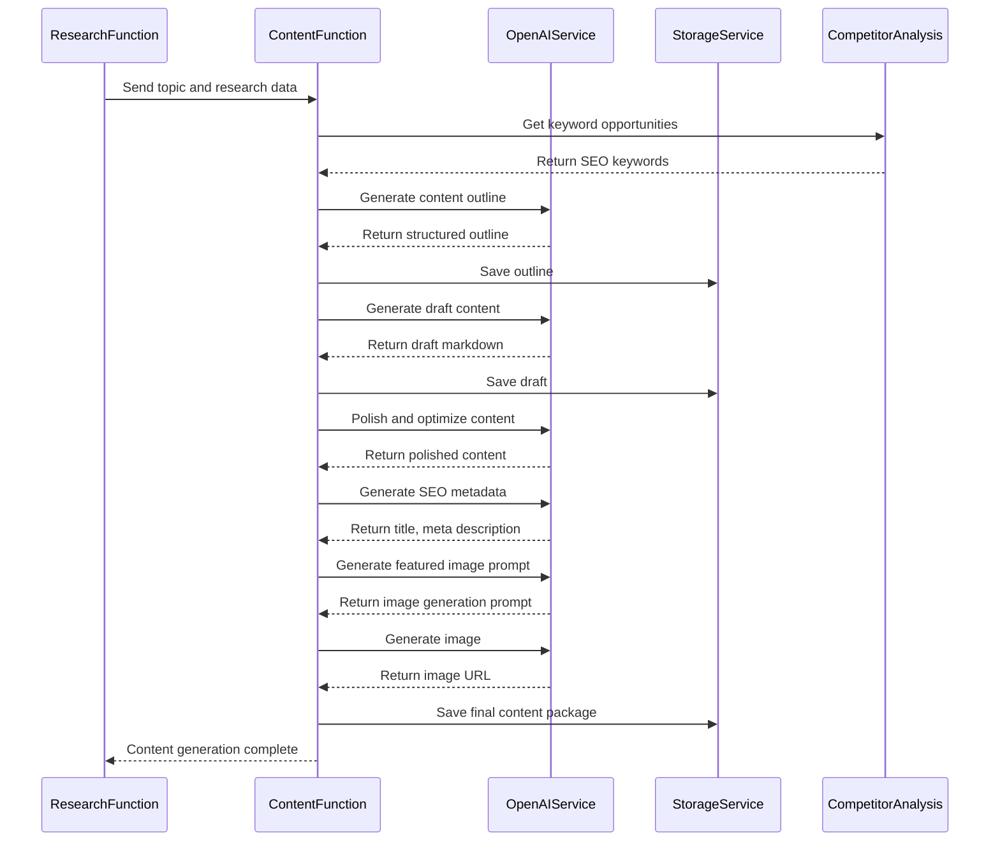

### 4. Publishing Workflow

The publishing workflow handles content delivery to WordPress and related platforms.

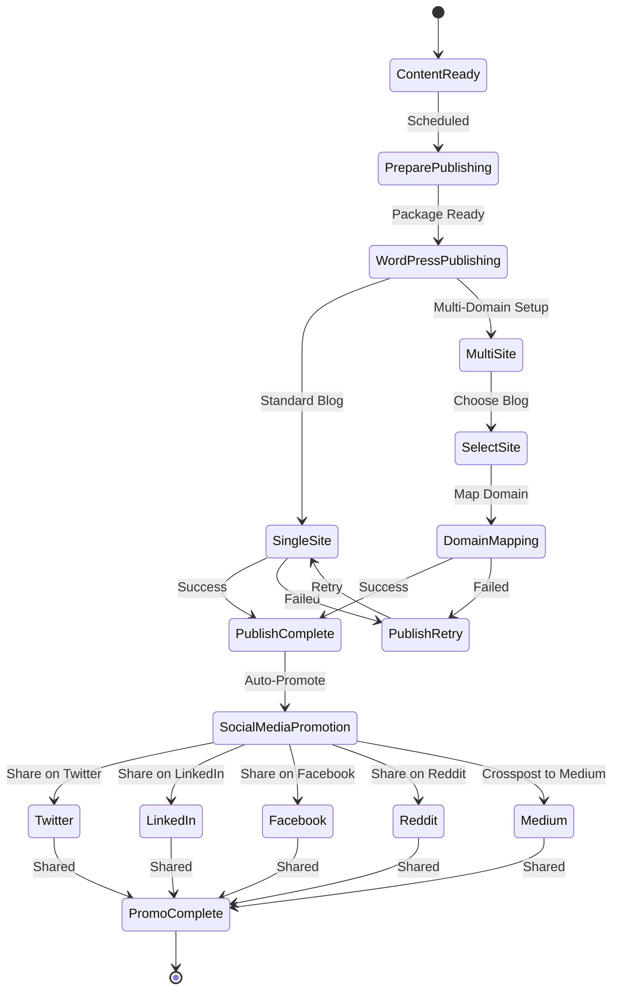

## Data Storage Structure

The system uses a structured storage approach for blogs, runs, and generated content.

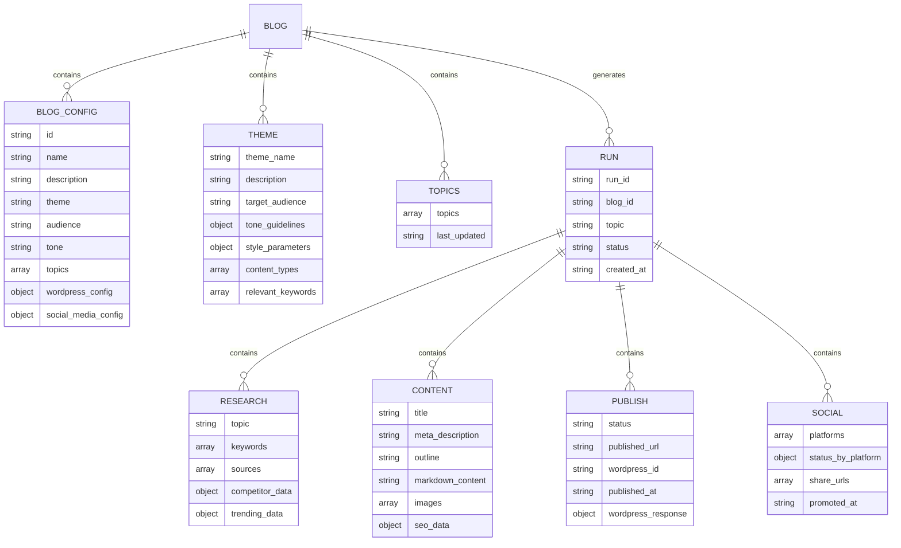

## Analytics and Monitoring

The system includes comprehensive analytics for tracking performance and optimizing content strategy.

```mermaid
graph TD
    classDef analytics fill:#9B59B6,color:white,stroke:none;
    classDef traffic fill:#3498DB,color:white,stroke:none;
    classDef engagement fill:#2ECC71,color:white,stroke:none;
    classDef monetization fill:#F1C40F,color:black,stroke:none;

    A[Analytics Dashboard] --> B[Traffic Analysis]:::traffic
    A --> C[Engagement Metrics]:::engagement
    A --> D[Monetization Tracking]:::monetization
    A --> E[Competitor Insights]:::analytics
    A --> F[Keyword Performance]:::analytics
    
    B --> B1[Google Analytics]:::traffic
    B --> B2[Search Console]:::traffic
    B --> B3[WordPress Analytics]:::traffic
    
    C --> C1[User Behavior]:::engagement
    C --> C2[Content Interaction]:::engagement
    C --> C3[Social Media Engagement]:::engagement
    
    D --> D1[AdSense Performance]:::monetization
    D --> D2[Affiliate Links]:::monetization
    D --> D3[Conversion Tracking]:::monetization
    
    E --> E1[Content Gap Analysis]:::analytics
    E --> E2[SEO Comparison]:::analytics
    E --> E3[Topic Coverage]:::analytics
    
    F --> F1[Keyword Rankings]:::analytics
    F --> F2[Opportunity Finder]:::analytics
    F --> F3[Content Recommendations]:::analytics
```

## AI Optimization System

The AI optimization system manages token usage, prompt efficiency, and cost optimization.

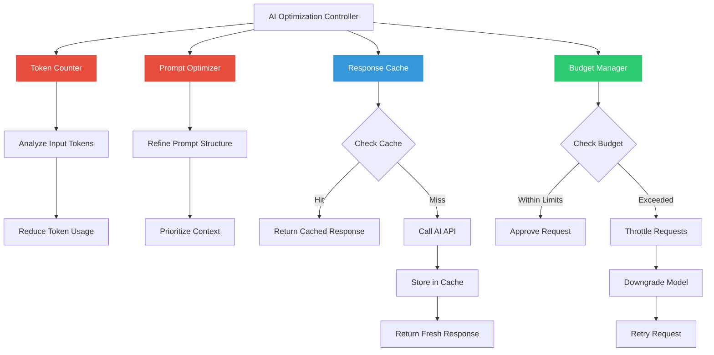

## Keyword Opportunity Finder

The keyword opportunity finder identifies valuable keywords based on competitor analysis.

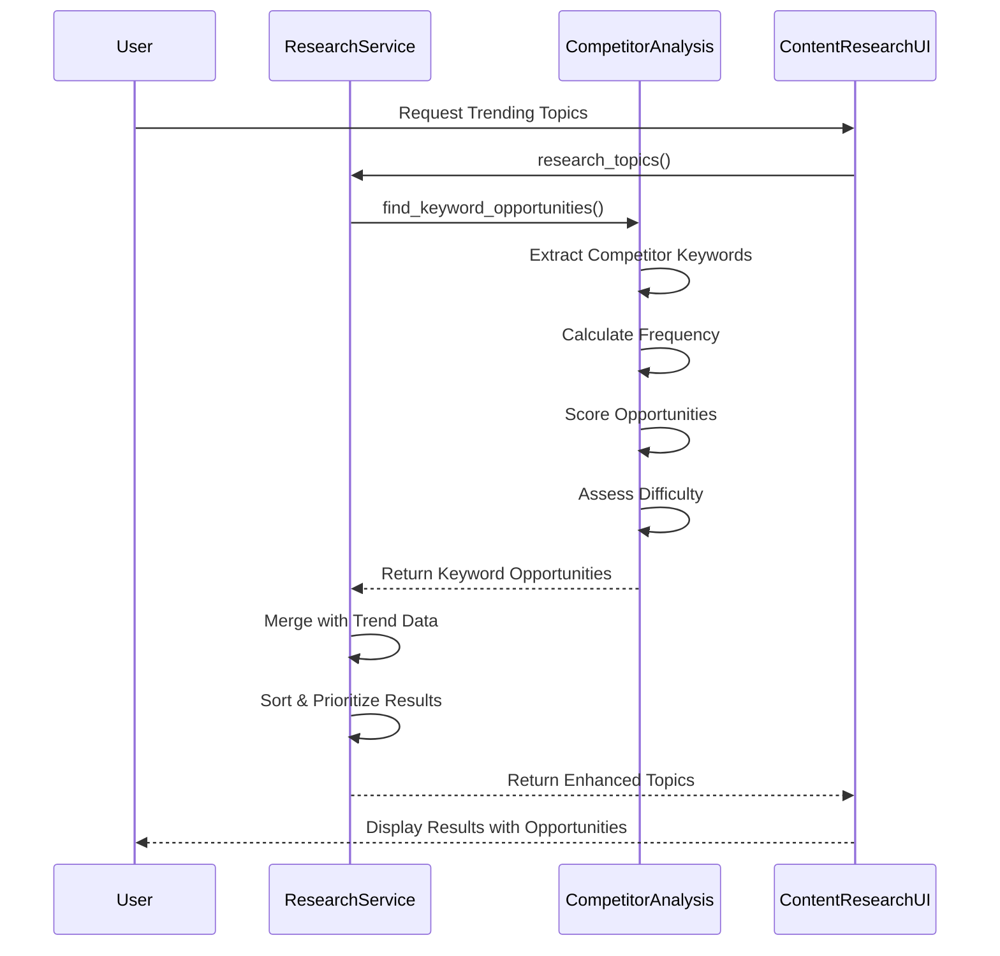

## Configuration Files

### Blog Configuration (`config.json`)

```json
{
  "name": "Tech Trends Blog",
  "description": "Latest insights on technology trends and innovations",
  "theme": "technology",
  "audience": "tech professionals",
  "tone": "informative",
  "topics": ["AI", "Cloud Computing", "Cybersecurity"],
  "wordpress_config": {
    "site_url": "https://techtrends.example.com",
    "username": "admin",
    "category_id": 5,
    "publishing_schedule": "weekly"
  },
  "social_media_config": {
    "twitter": true,
    "linkedin": true,
    "facebook": false,
    "reddit": true,
    "medium": false
  }
}
```

### Theme Configuration (`theme.json`)

```json
{
  "theme_name": "technology",
  "description": "Content focused on technology trends, innovations, and digital transformation",
  "target_audience": {
    "primary": "IT professionals",
    "secondary": "Technology enthusiasts",
    "characteristics": ["tech-savvy", "curious", "professionally motivated"]
  },
  "tone_guidelines": {
    "primary_tone": "informative",
    "secondary_tones": ["analytical", "future-oriented"],
    "voice": "authoritative but accessible",
    "avoid": ["overly technical jargon without explanation", "sensationalism"]
  },
  "style_parameters": {
    "paragraph_length": "medium",
    "sentence_complexity": "moderate",
    "use_of_metaphors": "occasional",
    "citation_style": "hyperlinked sources",
    "code_examples": "when relevant"
  },
  "content_types": [
    "how-to guides",
    "trend analysis",
    "product reviews",
    "industry news",
    "technical explainers"
  ],
  "relevant_keywords": [
    "digital transformation",
    "tech innovation",
    "emerging technology",
    "software development",
    "cloud computing",
    "AI and machine learning",
    "cybersecurity"
  ]
}
```

## System Integration Points

The system integrates with various external services to provide complete functionality.

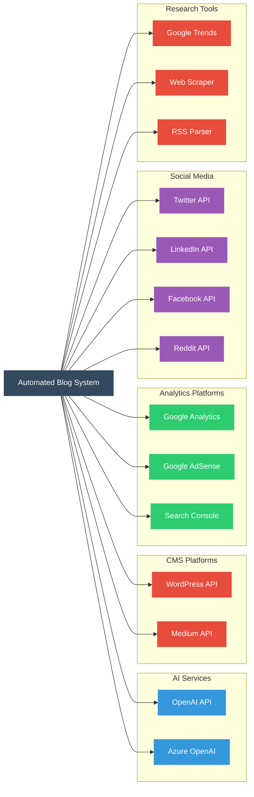

## Deployment Architecture

The system is deployed on Azure using a serverless architecture for optimal scaling and cost efficiency.

```mermaid
graph TB
    classDef azure fill:#0072C6,color:white,stroke:none;
    classDef function fill:#3498DB,color:white,stroke:none;
    classDef storage fill:#F1C40F,color:black,stroke:none;
    classDef keyvault fill:#2ECC71,color:white,stroke:none;
    classDef monitoring fill:#9B59B6,color:white,stroke:none;
    
    A[Azure Resource Group]:::azure
    
    A --> B[Azure Functions App]:::azure
    A --> C[Azure Storage Account]:::storage
    A --> D[Azure Key Vault]:::keyvault
    A --> E[Azure Application Insights]:::monitoring
    A --> F[Azure Monitor]:::monitoring
    
    B --> B1[Blog Setup Function]:::function
    B --> B2[Research Function]:::function
    B --> B3[Content Generator Function]:::function
    B --> B4[Publisher Function]:::function
    B --> B5[Social Media Function]:::function
    B --> B6[Analytics Function]:::function
    
    C --> C1[Blob Storage]:::storage
    C --> C2[Queue Storage]:::storage
    C --> C3[Table Storage]:::storage
    
    D --> D1[API Keys]:::keyvault
    D --> D2[Connection Strings]:::keyvault
    D --> D3[WordPress Credentials]:::keyvault
    
    E --> F
    
    E --> E1[Performance Monitoring]:::monitoring
    E --> E2[Error Tracking]:::monitoring
    E --> E3[Usage Analytics]:::monitoring
    
    F --> F1[Alerts]:::monitoring
    F --> F2[Dashboards]:::monitoring
```

## Getting Started with the System

To get started with the Automated Multi-Blog Content Pipeline:

1. Configure your blog through the web dashboard
2. Set up integration credentials for WordPress and social media
3. Define your blog's theme and target audience
4. Initialize the content research process
5. Review and approve generated content
6. Monitor performance through the analytics dashboard

This documentation provides a comprehensive overview of the system architecture, components, and workflows. For detailed API references and implementation guides, please refer to the individual component documentation.