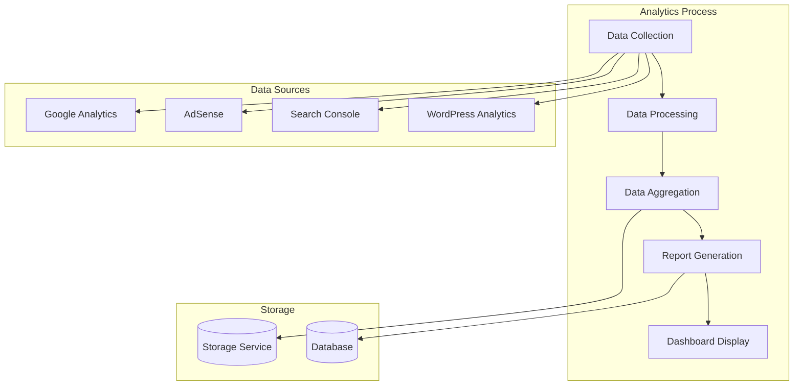
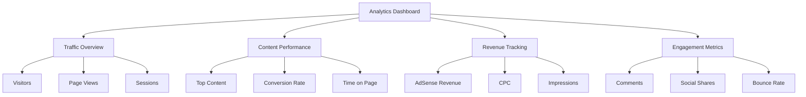

# Analytics Service Component

The Analytics Service component is responsible for tracking blog performance, gathering metrics from various sources, and providing insights for content optimization.

## Architecture



## Key Components

### AnalyticsService

Service that manages analytics data collection and processing:

- Collects data from various sources (Google Analytics, AdSense, Search Console, WordPress)
- Processes and aggregates data
- Generates reports
- Provides APIs for dashboard integration

### UsageTrackingService

Service that tracks system usage and billing:

- Monitors API usage (OpenAI, etc.)
- Tracks costs
- Provides usage reports
- Manages budget limits

## Configuration

The Analytics Service is configured through the following settings in the blog's `config.json` file:

```json
{
  "analytics": {
    "googleAnalytics": {
      "enabled": true,
      "trackingId": "UA-XXXXXXXX-X"
    },
    "adsense": {
      "enabled": true,
      "clientId": "ca-pub-XXXXXXXXXXXXXXXX"
    },
    "searchConsole": {
      "enabled": true
    },
    "wordpressAnalytics": {
      "enabled": true
    }
  }
}
```

## Dashboard Integration

The Analytics Service integrates with the admin dashboard to provide a comprehensive view of blog performance:



## Key Functions

- `collect_analytics_data(blog_id, date_range)`: Collects analytics data for a blog
- `process_data(raw_data)`: Processes raw analytics data
- `aggregate_data(processed_data)`: Aggregates data across different sources
- `generate_report(aggregated_data, report_type)`: Generates a report based on aggregated data
- `track_api_usage(service, operation, tokens)`: Tracks API usage
- `calculate_costs(usage_data)`: Calculates costs based on usage data

## Integration Points

- **Input**: Collects data from various sources
- **Output**: Provides data for dashboard display
- **Storage**: Stores analytics data in blob storage and database
- **External Services**: Interacts with Google Analytics, AdSense, Search Console, and WordPress