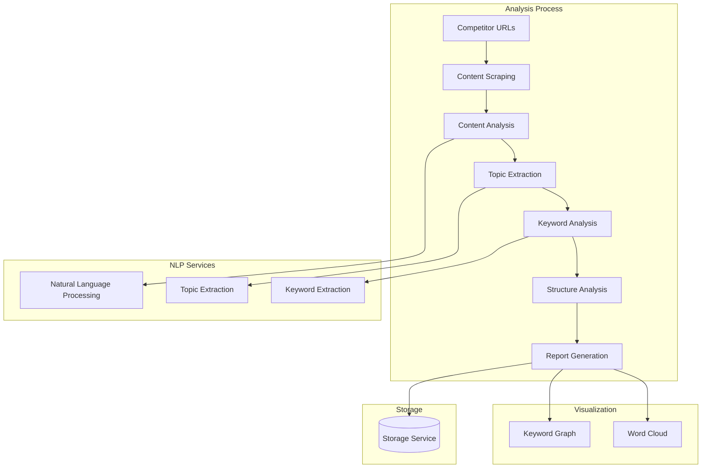
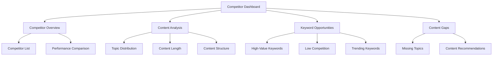

# Competitor Analysis Component

The Competitor Analysis component is responsible for analyzing competitor content, identifying gaps, and providing recommendations for content creation.

## Architecture



## Key Components

### CompetitorAnalysisService

Service that manages competitor analysis:

- Tracks competitor websites
- Scrapes competitor content
- Analyzes content structure and topics
- Identifies keyword opportunities
- Generates reports

### KeywordOpportunityFinder

Component that identifies keyword opportunities based on competitor analysis:

- Analyzes keyword usage across competitors
- Identifies high-value keywords with low competition
- Suggests keyword combinations
- Prioritizes keywords based on value and competition

## Configuration

The Competitor Analysis component is configured through the following settings in the blog's `config.json` file:

```json
{
  "competitorAnalysis": {
    "enabled": true,
    "competitors": [
      "https://competitor1.com",
      "https://competitor2.com"
    ],
    "analysisFrequency": "weekly",
    "keywordOpportunities": true,
    "contentGapAnalysis": true
  }
}
```

## Dashboard Integration

The Competitor Analysis component integrates with the admin dashboard to provide a comprehensive view of competitor insights:



## Key Functions

- `track_competitor(url, blog_id)`: Adds a competitor for tracking
- `scrape_competitor_content(competitor_id)`: Scrapes content from a competitor
- `analyze_content(content)`: Analyzes content structure and topics
- `extract_keywords(content)`: Extracts keywords from content
- `find_keyword_opportunities(blog_id)`: Identifies keyword opportunities
- `generate_report(competitor_id, blog_id)`: Generates a competitor analysis report
- `find_content_gaps(blog_id)`: Identifies content gaps based on competitor analysis

## Integration Points

- **Input**: Competitor URLs and blog configuration
- **Output**: Competitor analysis reports and content recommendations
- **Storage**: Stores competitor data and analysis results
- **External Services**: Uses web scraping and NLP services
- **Dashboard**: Integrates with the admin dashboard for visualization