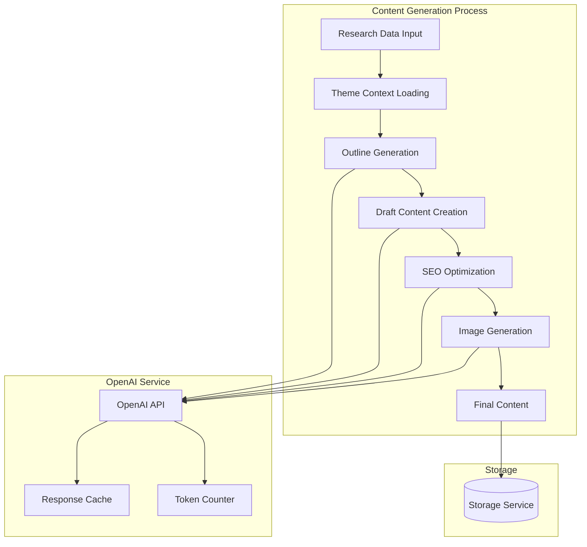

# Content Generation Component

The Content Generation component is responsible for creating high-quality, SEO-optimized blog content based on research data and theme configuration.

## Architecture



## Key Components

### ContentGenerator

The main Azure Function that orchestrates the content generation process:

- Receives research data from the ResearchTopic function
- Loads theme context from the blog configuration
- Generates an outline based on the research data
- Creates draft content using OpenAI
- Optimizes content for SEO
- Generates relevant images
- Saves the content to storage

### OpenAIService

Service that handles interactions with OpenAI APIs:

- Manages API requests and responses
- Implements token counting and optimization
- Provides caching for repeated requests
- Selects appropriate models based on the task

### SEOOptimizer

Component that optimizes content for search engines:

- Analyzes keywords and relevance
- Suggests improvements for content structure
- Ensures proper heading hierarchy
- Optimizes meta descriptions and titles

## Configuration

The Content Generation component is configured through the following settings in the blog's `config.json` file:

```json
{
  "contentGeneration": {
    "model": "gpt-4o",
    "draftModel": "gpt-3.5-turbo",
    "maxTokens": 4000,
    "temperature": 0.7,
    "imageGeneration": true,
    "imageStyle": "photorealistic",
    "contentLength": "medium",
    "formats": ["blog", "social"]
  }
}
```

## Key Functions

- `generate_outline(topic, theme_context)`: Creates a structured outline based on the research topic and theme context
- `draft_content(outline, theme_context)`: Generates the initial draft content using the outline
- `optimize_content(draft, keywords)`: Optimizes the content for SEO using keywords and best practices
- `generate_images(content, theme_context)`: Creates relevant images for the content based on the theme

## Integration Points

- **Input**: Receives research data from the ResearchTopic function
- **Output**: Sends generated content to the Publisher function
- **Storage**: Stores content in blob storage
- **External Services**: Interacts with OpenAI API for content and image generation