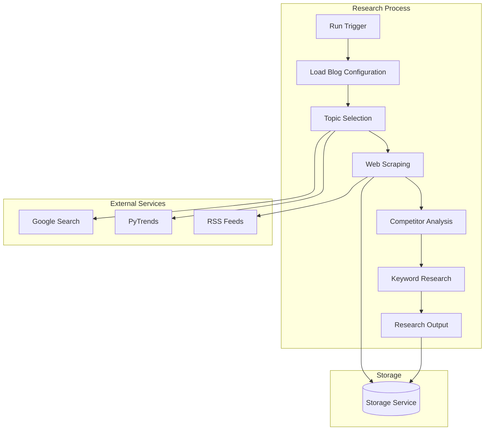

# Research Service Component

The Research Service component is responsible for discovering trending topics, analyzing competitor content, and gathering relevant data for content generation.

## Architecture



## Key Components

### ResearchTopic

The main Azure Function that orchestrates the research process:

- Triggered by a new run folder creation
- Loads blog configuration and theme context
- Selects a relevant topic based on trends and blog focus
- Performs web scraping to gather relevant information
- Analyzes competitor content
- Identifies valuable keywords
- Outputs research data for content generation

### WebScraperService

Service that handles web scraping operations:

- Scrapes content from various sources
- Parses RSS feeds
- Extracts relevant information from web pages
- Maintains a source tracker to avoid duplicate content

### CompetitorAnalysisService

Service that analyzes competitor content:

- Identifies top-performing content in the niche
- Analyzes content structure and topics
- Identifies keyword opportunities
- Suggests content gaps to fill

## Configuration

The Research Service is configured through the following settings in the blog's `config.json` file:

```json
{
  "research": {
    "maxSources": 5,
    "includeCompetitors": true,
    "keywordResearch": true,
    "trendingTopicsWeight": 0.7,
    "focusTopicsWeight": 0.3,
    "maxKeywords": 10
  }
}
```

## Key Functions

- `select_topic(blog_config, trending_topics)`: Selects a topic based on trending topics and blog focus
- `research_topic(topic, blog_config)`: Performs comprehensive research on a topic
- `extract_keywords(research_data)`: Identifies valuable keywords from research data
- `analyze_competitors(topic, competitors)`: Analyzes competitor content related to the topic
- `scrape_content(sources)`: Scrapes content from various sources

## Integration Points

- **Input**: Triggered by new run folder creation
- **Output**: Outputs research data for the ContentGenerator function
- **Storage**: Stores research data in blob storage
- **External Services**: Interacts with Google Search, PyTrends, and RSS feeds