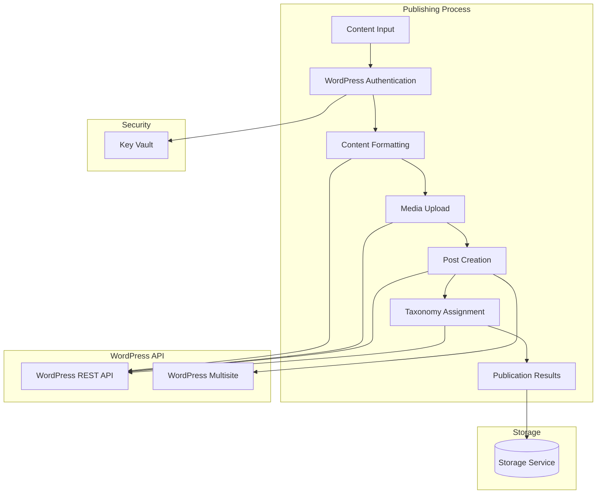
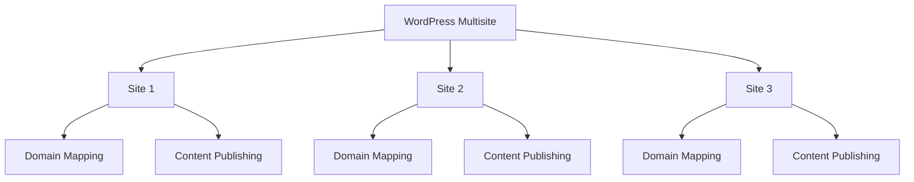

# WordPress Integration Component

The WordPress Integration component is responsible for publishing generated content to WordPress sites, managing media, and configuring WordPress settings.

## Architecture



## Key Components

### Publisher

The main Azure Function that orchestrates the publishing process:

- Receives generated content from the ContentGenerator function
- Authenticates with WordPress using credentials from Key Vault
- Formats content for WordPress
- Uploads media files
- Creates posts with appropriate taxonomies
- Handles WordPress Multisite functionality
- Outputs publication results

### WordPressService

Service that handles interactions with WordPress:

- Manages connections to WordPress sites
- Provides methods for content publishing
- Handles media upload and management
- Configures WordPress settings
- Supports WordPress Multisite functionality

## Configuration

The WordPress Integration is configured through the following settings in the blog's `config.json` file:

```json
{
  "wordpress": {
    "url": "https://example.com",
    "username": "username",
    "useKeyVault": true,
    "isMultisite": true,
    "domain": "blog.example.com",
    "categories": ["Technology", "AI"],
    "tags": ["automation", "content"],
    "status": "publish",
    "featured_image": true
  }
}
```

## Multisite Support

The WordPress Integration component includes comprehensive support for WordPress Multisite:



## Key Functions

- `publish_content(content, blog_config)`: Publishes content to WordPress
- `upload_media(media, blog_config)`: Uploads media files to WordPress
- `create_post(content, media, blog_config)`: Creates a post with media
- `assign_taxonomies(post_id, categories, tags)`: Assigns categories and tags to a post
- `configure_site(blog_config)`: Configures a WordPress site based on blog configuration

## Integration Points

- **Input**: Receives generated content from the ContentGenerator function
- **Output**: Outputs publication results for the SocialMediaPromoter function
- **Storage**: Stores publication results in blob storage
- **External Services**: Interacts with WordPress REST API
- **Security**: Retrieves credentials from Azure Key Vault